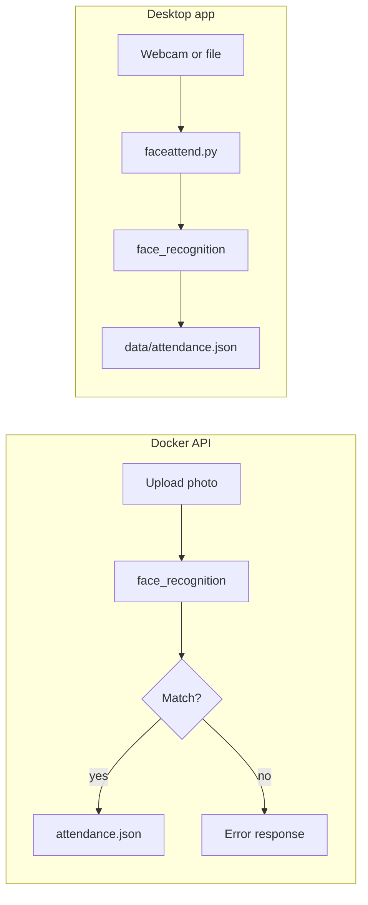

# FaceAttend

REST API and desktop app for registering student faces and marking attendance from uploaded photos or webcam capture.

## How it works



1. **Register** — `POST /register/{student_id}` with a clear face photo. The API stores a 128-dimensional face encoding in `data/face_encodings.json`.
2. **Recognize** — `POST /recognize` with a photo; returns the matched `student_id` and confidence.
3. **Mark attendance** — `POST /attendance/mark` recognizes the face and appends a timestamped record to `data/attendance.json`.

Interactive API docs: **http://localhost:8000/docs**

## Desktop app (all-in-one GUI)

Run FaceAttend as a single program with webcam, registration, and attendance in one window. It uses the same logic and data files as the API (`data/face_encodings.json`, `data/attendance.json`).

**Requirements:** install local dependencies (GUI OpenCV, not headless):

```bash
pip uninstall -y opencv-contrib-python-headless opencv-python-headless
pip install -r requirements-local.txt
```

```bash
python faceattend.py
```

| Tab | What it does |
|-----|----------------|
| **Register** | Capture or upload a photo to register a student ID |
| **Mark attendance** | Recognize a face and log attendance (optional course name) |
| **Students** | List registered student IDs |
| **Attendance log** | View recent attendance records |

Use **Start API server** in the app header if you also want REST access at http://localhost:8000/docs.

## Quick start with Docker

**Requirements:** [Docker](https://docs.docker.com/get-docker/) and Docker Compose.

```bash
docker compose up --build
```

API: http://localhost:8000  
Docs: http://localhost:8000/docs

### Example requests

Register a student:

```bash
curl -X POST "http://localhost:8000/register/student001" \
  -F "file=@photo.jpg"
```

Mark attendance:

```bash
curl -X POST "http://localhost:8000/attendance/mark?course=Math101" \
  -F "file=@photo.jpg"
```

List attendance:

```bash
curl "http://localhost:8000/attendance"
```

## Local development (without Docker)

```bash
python -m venv .venv
# Windows
.venv\Scripts\activate
# Linux/macOS
source .venv/bin/activate

pip install -r requirements.txt
uvicorn app.main:app --reload --host 0.0.0.0 --port 8000
```

On Windows, `face_recognition` / `dlib` may need [Visual Studio Build Tools](https://visualstudio.microsoft.com/visual-cpp-build-tools/). Docker is the recommended way to run the API.

## Environment variables

| Variable | Default | Description |
|----------|---------|-------------|
| `DATA_DIR` | `data` | Encodings and attendance storage |
| `UPLOAD_DIR` | `uploads` | Temporary upload directory |
| `FACE_TOLERANCE` | `0.5` | Lower = stricter matching (0.4–0.6 typical) |
| `CORS_ORIGINS` | `*` | Comma-separated allowed origins |

## Project layout

```
faceattend/
├── app/
│   ├── main.py           # FastAPI routes
│   ├── gui.py            # Desktop application
│   ├── face_service.py   # Register / recognize
│   └── attendance.py     # Attendance log
├── faceattend.py         # Launch desktop app
├── Dockerfile
├── docker-compose.yml
└── requirements.txt
```

## Privacy

Do **not** commit real student photos. `dataset/`, `data/`, and `uploads/` are listed in `.gitignore`.

## License

MIT (adjust as needed for your course or organization).
